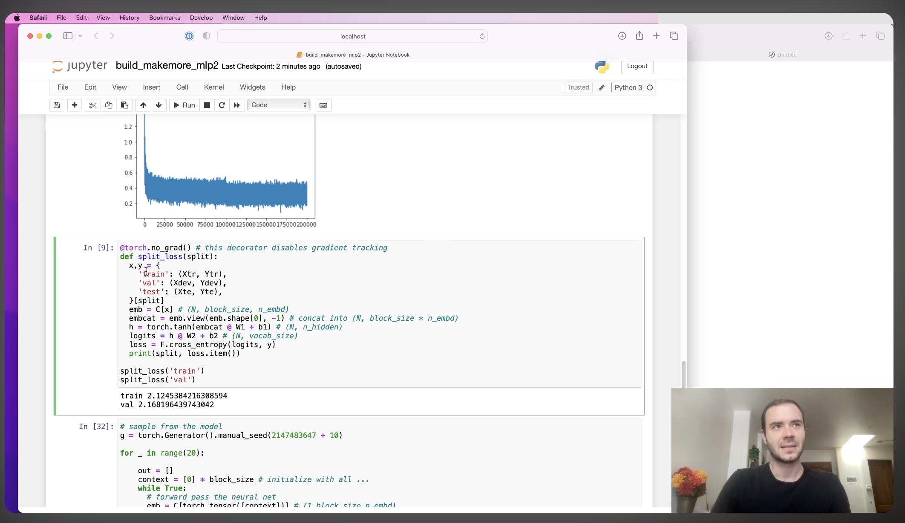
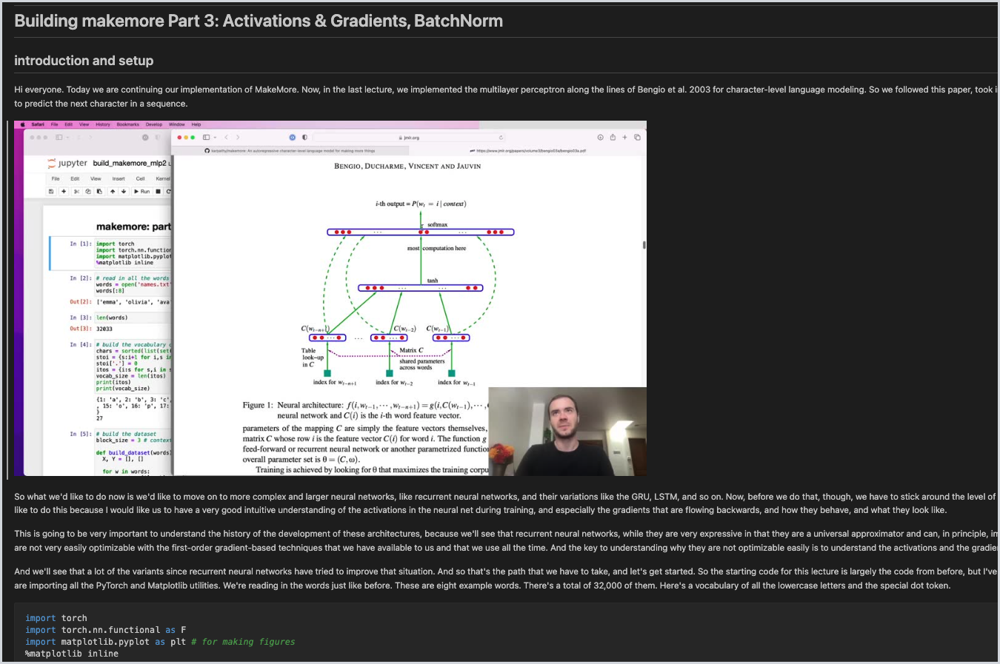

# Notetaker

Convert MP4 video lectures into comprehensive, lossless markdown documents.

This project was inspire by andrej karpathy's challenge to create an automated note taker: https://x.com/karpathy/status/1760740503614836917

## Demo

<table>
<tr>
<td align="center"><strong>Video</strong></td>
<td align="center"><strong>Notes</strong></td>
</tr>
<tr>
<td></td>
<td></td>
</tr>
</table>

## Features

- **Lossless translation**: Preserves the speaker's voice — no paraphrasing
- **Parallel pipeline**: Audio + frame extraction run concurrently, Whisper chunks transcribe in parallel
- **Opus 4.6 agent**: Orchestrates cleanup, visual analysis, and assembly — then reviews its own output and revises if needed
- **Smart visual handling**: Extracts code/math from frames, keeps diagrams as images, skips talking-head frames
- **Checkpointed jobs**: Resume interrupted jobs from where they left off

## Quick Start

```bash
uv sync

# Set API keys in .env or environment
export OPENAI_API_KEY="..."       # Whisper transcription
export AWS_REGION="us-east-1"     # Bedrock region
export AWS_ACCESS_KEY_ID="..."
export AWS_SECRET_ACCESS_KEY="..."
export AWS_SESSION_TOKEN="..."    # If using temporary credentials

# Start server
uv run notetaker
# Open http://localhost:8000
```

## How It Works

1. **Extract** — ffmpeg pulls audio (MP3) and frames (interval + scene change) in parallel
2. **Transcribe** — OpenAI Whisper API processes audio chunks in parallel with word-level timestamps
3. **Segment** — Groups transcript + frames into ~3-minute segments at natural pauses
4. **Agent** — Opus 4.6 orchestrates worker models via tool_use:
   - **Haiku** cleans grammar (parallel, 5 workers)
   - **Sonnet** analyzes visuals with vision (parallel, 3 workers)
   - **Sonnet** assembles the final markdown with structure hints
   - **Opus 4.6** reviews the output and requests revisions if needed

## Requirements

- Python 3.10+
- **ffmpeg** + **ffprobe** (system install)
- **OPENAI_API_KEY** for Whisper STT
- **AWS credentials** for Claude on Bedrock (Opus 4.6, Sonnet, Haiku)

## Project Structure

```
src/           — Python package (app, pipeline, LLM agent)
static/        — Frontend (HTML, CSS, JS)
tests/         — API smoke tests
docs/          — Architecture documentation
output/jobs/   — Runtime job data (gitignored)
```

## License

MIT
